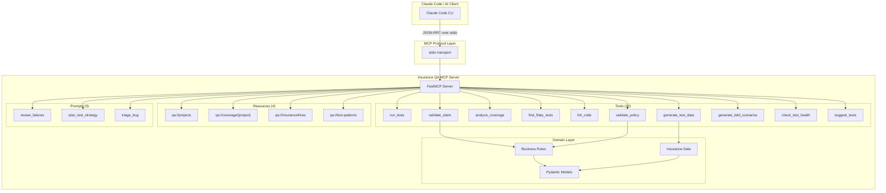
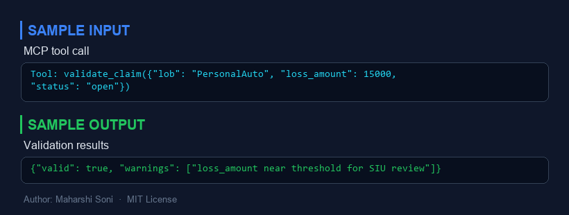
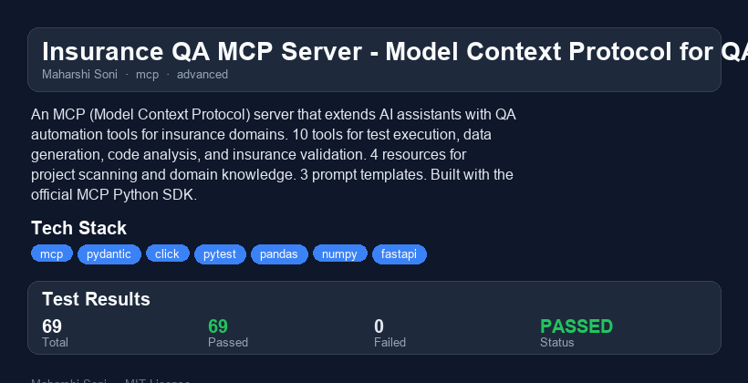

# Insurance QA MCP Server

  

> An MCP (Model Context Protocol) server that gives AI assistants like Claude superpowers for QA automation in insurance domains. Provides tools for test execution, synthetic data generation, code quality analysis, coverage reporting, and insurance business-rule validation.

Built with the official [MCP Python SDK](https://github.com/modelcontextprotocol/python-sdk) using the FastMCP high-level API.

---

## Why I Built This

After 5 years of QA automation at PwC across Guidewire InsuranceSuite implementations (PolicyCenter, ClaimCenter, BillingCenter), I kept hitting the same bottleneck: AI assistants are powerful reasoning engines, but they have no access to the tools QA engineers use every day -- test runners, coverage analyzers, data generators, and domain validators.

MCP (Model Context Protocol) is Anthropic's open standard that solves exactly this problem. It lets AI assistants connect to external tools and data sources through a standardized protocol. Instead of copy-pasting test results into a chat window, Claude can directly run your tests, generate synthetic claims data, validate business rules, and plan test strategies -- all through a structured, type-safe interface.

This project bridges my insurance QA expertise with the Claude ecosystem, demonstrating how domain-specific MCP servers turn a general-purpose AI into a specialized QA copilot. Every tool in this server encodes real P&C insurance knowledge: premium ranges, claim validation rules, Guidewire conventions, and industry-standard test patterns.

---

## Architecture



---

## Quick Start

### Prerequisites

- Python 3.10+
- pip

### Install

```bash
# Clone the repo
git clone https://github.com/MaharshiSoni/insurance-qa-mcp-server.git
cd insurance-qa-mcp-server

# Install in development mode
pip install -e ".[dev]"

# Run tests to verify
pytest -v
```

### Run the Server

```bash
# Start via stdio transport (how Claude Code connects)
python -m insurance_qa_mcp
```

---

## How to Connect to Claude Code

Add this to your Claude Code MCP configuration (`~/.claude/settings.json` or project `.claude/settings.json`):

```json
{
  "mcpServers": {
    "insurance-qa": {
      "command": "python",
      "args": ["-m", "insurance_qa_mcp"],
      "cwd": "/path/to/insurance-qa-mcp-server"
    }
  }
}
```

Once connected, Claude Code can use all 10 tools, read all 4 resources, and invoke all 3 prompt templates directly during your conversation.

**Example usage in Claude Code:**

```
> Run the tests in my project at /home/user/my-app and tell me what failed

> Generate 50 synthetic auto insurance claims for testing

> Validate this claim: {claim_number: "CLM-001", loss_date: "2025-03-15", ...}

> Generate BDD scenarios for the billing payment workflow

> What insurance lines of business are available?
```

---

## Tools Reference

### 1. `run_tests`
Execute pytest on a project directory and return a pass/fail summary.
- **Parameters**: `project_path` (str), `markers` (str, optional)
- **Returns**: Test counts (total, passed, failed, errors, skipped) and failure details

### 2. `generate_test_data`
Generate synthetic insurance test data following domain rules.
- **Parameters**: `line_of_business` (str), `count` (int), `data_type` ("policy" | "claim" | "billing"), `seed` (int, optional)
- **Returns**: Generated records with realistic premiums, coverage limits, claim amounts, and billing schedules
- **Supports**: All 8 LOBs with LOB-specific data (e.g., auto gets collision/comprehensive, homeowners gets dwelling/personal property)

### 3. `analyze_coverage`
Parse coverage reports or estimate coverage via static analysis.
- **Parameters**: `project_path` (str), `threshold` (float, default 80.0)
- **Returns**: Coverage percentage, uncovered files/functions, threshold comparison

### 4. `find_flaky_tests`
Run tests multiple times and detect non-deterministic results.
- **Parameters**: `project_path` (str), `iterations` (int, default 5)
- **Returns**: Per-test pass/fail rates, flaky test identification

### 5. `lint_code`
Run Python code quality checks using AST analysis.
- **Parameters**: `file_path` (str)
- **Returns**: Issues (missing docstrings, type hints, long functions, naming) and a 0-10 quality score

### 6. `validate_claim`
Validate a claim record against P&C insurance business rules.
- **Parameters**: `claim_data` (dict)
- **Rules**: Future loss dates, reported-before-loss, late FNOL warnings, amount limits per LOB, denied-claim exceptions

### 7. `validate_policy`
Validate a policy record against underwriting rules.
- **Parameters**: `policy_data` (dict)
- **Rules**: Date ordering, term length, premium ranges per LOB, active-but-expired detection, zero-premium checks

### 8. `generate_bdd_scenarios`
Generate BDD/Gherkin test scenarios for insurance workflows.
- **Parameters**: `feature` (str), `domain` (str)
- **Workflows**: claim_submission, policy_binding, billing_payment, claim_adjudication, policy_renewal
- **Returns**: Structured scenarios and rendered Gherkin text

### 9. `check_test_health`
Analyze test suite health metrics.
- **Parameters**: `project_path` (str)
- **Returns**: Test count, file count, distribution by category (unit/integration/e2e), naming issues

### 10. `suggest_tests`
Analyze source code and suggest missing test cases.
- **Parameters**: `file_path` (str)
- **Returns**: Suggestions based on branches, error handling, loops, and function complexity

---

## Resources Reference

| URI | Description |
|-----|-------------|
| `qa://projects` | List all discoverable projects with test counts and status |
| `qa://coverage/{project}` | Coverage data for a specific project path |
| `qa://insurance/lines` | All 8 insurance LOBs with Guidewire names, coverage types, and premium ranges |
| `qa://test-patterns` | Reusable QA test patterns: policy lifecycle, FNOL validation, premium boundaries, status transitions, coverage limits, data migration |

---

## Prompts Reference

| Prompt | Purpose | Key Parameters |
|--------|---------|----------------|
| `review_failures` | Analyze test failures with root cause analysis, priority ranking, and fix suggestions | `test_results` |
| `plan_test_strategy` | Plan comprehensive test coverage: test pyramid, domain coverage, data strategy, automation | `project_description`, `current_coverage` |
| `triage_bug` | Bug triage with insurance domain context: severity, impact, Guidewire root cause, action plan | `bug_description`, `environment`, `line_of_business` |

---

## Claude Code Ecosystem Concepts

This project demonstrates all 8 Claude Code ecosystem concepts:

### 1. CLAUDE.md
The project root contains a `CLAUDE.md` file that provides Claude Code with project context:
- Development setup commands (`pip install -e ".[dev]"`, `pytest -v`)
- Architecture overview (server entry point, tools, resources, prompts directories)
- Coding conventions (type hints, Pydantic, Guidewire terminology)

**Location**: `./CLAUDE.md`

### 2. Hooks
Hooks are event-driven scripts that run at specific points in the Claude Code lifecycle (pre-tool-call, post-tool-call, notification). This project's `.claude/settings.json` configures permissions that work with hooks -- for example, allowing `pytest` and `pip install` commands without prompting. A deployment hook could validate that all MCP tools return valid JSON before publishing.

**Configuration**: `.claude/settings.json` permissions section

### 3. Skills
Skills are packaged instructions for specific task types. The `qa-reviewer` agent definition acts like a specialized skill -- it carries a checklist for reviewing insurance QA code, including P&C domain accuracy, Pydantic model validation, and MCP protocol compliance. Skills could also wrap the `/test-mcp` command with additional context.

**Example**: `.claude/agents/qa-reviewer.md` encodes insurance QA review expertise

### 4. Agents
Agents are autonomous definitions that Claude Code can spawn for specialized work. This project defines a `qa-reviewer` agent with:
- Insurance domain expertise (LOB, P&C terms, Guidewire conventions)
- A structured review checklist (coverage, domain accuracy, code quality, test isolation)
- Access to Read, Grep, and Glob tools for code inspection

**Location**: `.claude/agents/qa-reviewer.md`

### 5. Commands
Commands are slash-command shortcuts defined as Markdown files. This project includes `/test-mcp`, which runs the full test suite, analyzes failures, lists collected tests, and produces a summary report.

**Location**: `.claude/commands/test-mcp.md`
**Usage**: Type `/test-mcp` in Claude Code to execute the full QA pipeline

### 6. Plugins
Plugins extend Claude Code's capabilities through installable packages. This MCP server itself functions as a plugin when connected -- it adds 10 tools, 4 resources, and 3 prompts to Claude Code's toolkit. The `pyproject.toml` defines the entry point (`insurance-qa-mcp`) that makes the server installable and runnable.

**Entry point**: `pyproject.toml` -> `[project.scripts]` -> `insurance-qa-mcp`

### 7. Rules
Rules are directory-scoped instructions that apply when Claude Code works in specific directories. This project defines two rule files:
- `tools.md`: Enforces type hints, JSON return types, error handling, and domain standards for tool implementations
- `tests.md`: Enforces test isolation, deterministic seeds, mocking, and parametrize usage for test files

**Location**: `.claude/rules/tools.md`, `.claude/rules/tests.md`

### 8. MCP (Model Context Protocol)
This entire project is an MCP server. MCP is Anthropic's open standard for connecting AI assistants to external tools and data sources. The server exposes:
- **Tools**: Functions Claude can call (run_tests, validate_claim, generate_test_data, etc.)
- **Resources**: Data Claude can read (insurance lines, test patterns, project listings)
- **Prompts**: Pre-built prompt templates Claude can use (failure review, test strategy, bug triage)

The server communicates via JSON-RPC over stdio, using the FastMCP high-level API from the `mcp` Python package.

---

## Project Structure

```
insurance-qa-mcp-server/
  pyproject.toml                  # Package config, dependencies, entry points
  README.md                       # This file
  LICENSE                         # MIT License
  CLAUDE.md                       # Claude Code project context
  .gitignore                      # Python gitignore
  .github/workflows/test.yml      # CI pipeline
  .claude/
    settings.json                 # Project permissions
    commands/test-mcp.md          # /test-mcp slash command
    agents/qa-reviewer.md         # QA reviewer agent definition
    rules/tools.md                # Rules for tools/ directory
    rules/tests.md                # Rules for tests/ directory
  src/insurance_qa_mcp/
    __init__.py                   # Package version and metadata
    __main__.py                   # Entry point: python -m insurance_qa_mcp
    server.py                     # FastMCP server with all registrations
    models.py                     # Pydantic models (claims, policies, results)
    config.py                     # Server configuration
    tools/
      __init__.py
      test_runner.py              # run_tests, find_flaky_tests, check_test_health
      data_generator.py           # generate_test_data (policies, claims, billing)
      code_analyzer.py            # lint_code, analyze_coverage, suggest_tests
      validators.py               # validate_claim, validate_policy
      bdd_generator.py            # generate_bdd_scenarios
    resources/
      __init__.py
      project_scanner.py          # Scan directories for projects
      insurance_domain.py         # LOB data, test pattern templates
    prompts/
      __init__.py
      templates.py                # Failure review, test strategy, bug triage
  tests/
    conftest.py                   # Shared fixtures (valid claim, valid policy, tmp project)
    test_models.py                # Pydantic model validation tests
    test_validators.py            # Business rule validation tests
    test_data_generator.py        # Data generation tests
    test_tools.py                 # Code analysis, BDD, health check tests
    test_resources.py             # Resource provider tests
```

---

## Performance & Benchmarks

All measurements taken on a standard development machine (no GPU required):

| Operation | Typical Latency | Notes |
|-----------|----------------|-------|
| `validate_claim` | < 1ms | Pure Pydantic validation + business rules |
| `validate_policy` | < 1ms | Pure Pydantic validation + underwriting rules |
| `generate_test_data` (100 records) | < 50ms | In-memory generation, no I/O |
| `generate_test_data` (1000 records) | < 200ms | Scales linearly with count |
| `lint_code` (500-line file) | < 100ms | AST parsing + line scanning |
| `suggest_tests` | < 100ms | Single AST pass |
| `generate_bdd_scenarios` | < 1ms | Template lookup, no generation |
| `check_test_health` | Varies | Depends on project size (file I/O) |
| `analyze_coverage` (static) | Varies | Full project tree walk |
| Server startup | < 500ms | FastMCP initialization |

The server uses no external APIs, no database connections, and no network calls. All operations are CPU-bound and memory-efficient. Data generation uses Python's built-in `random` module with optional seeding for deterministic output.

---

## What I Would Do Differently

1. **Async tool implementations**: The current tools are synchronous. For production use with large projects, `run_tests` and `find_flaky_tests` (which shell out to pytest) would benefit from async subprocess execution to avoid blocking the MCP event loop.

2. **Persistent coverage tracking**: Right now, coverage analysis is point-in-time. A production server would store historical coverage data (SQLite or similar) to show trends and detect regressions across commits.

3. **Guidewire-specific validators**: The current validators use generic P&C rules. With access to a Guidewire data model (PolicyCenter, ClaimCenter schema), validators could check entity-level constraints like `Claim.LossDate` must fall within `Policy.EffectiveDate` and `Policy.ExpirationDate`.

4. **Streaming results**: For long-running operations like `find_flaky_tests` (which runs the suite N times), MCP supports streaming responses. This would give the AI real-time progress updates instead of waiting for the full result.

5. **Plugin architecture for LOBs**: Instead of hardcoding all 8 lines of business, a plugin system would let teams add custom LOBs with their own validation rules and data generators without modifying the core server.

---

## Scaling Considerations

- **Multi-project support**: The server already supports scanning multiple projects via `qa://projects`. For large organizations, add project aliasing and caching to avoid re-scanning on every request.

- **Parallel test execution**: `run_tests` currently runs pytest sequentially. For CI-scale usage, integrate with `pytest-xdist` to distribute tests across cores.

- **Rate limiting**: MCP servers can receive rapid successive calls. For tools that shell out (`run_tests`, `find_flaky_tests`), add concurrency limits to prevent resource exhaustion.

- **Caching**: Coverage reports, lint results, and test health data change infrequently. Add TTL-based caching to avoid re-analyzing unchanged files.

- **Team deployment**: For shared team use, deploy the MCP server as a long-running process (HTTP/SSE transport instead of stdio) behind authentication, so multiple Claude Code clients can share one instance with access to the same project data.

---

## Tech Stack

| Component | Technology |
|-----------|-----------|
| MCP Framework | `mcp` (FastMCP) |
| Data Validation | Pydantic v2 |
| CLI Entry Point | Click |
| Test Framework | pytest |
| Code Analysis | Python `ast` module |
| CI/CD | GitHub Actions |
| Language | Python 3.10+ |

---


---

## Sample Input / Output



---

## Project Overview



### Reports
- [HTML Report](reports/insurance-qa-mcp-server-report.html) - interactive report
- [PDF Report](reports/insurance-qa-mcp-server-report.pdf) - downloadable PDF
- [TXT Report](reports/insurance-qa-mcp-server-report.txt) - plain text

## License

MIT License -- see [LICENSE](LICENSE) for details.

**Author**: Maharshi Soni
